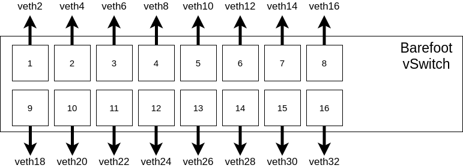

# Running and testing PolKa code

To run the PolKa code you need to follow the next steps:

1. Clone the repository

```sh
~$ git clone https://github.com/nerds-ufes/polka-tofino
```

2. Go to the code directory

```sh
~$ cd polka-tofino/p4src/
```

3. Running the P4 program
   1. Open a terminal (1) to run the Tofino model daemon:
        ```sh
        ~$ ./run_tofino_model.sh -p polka
        ```
   2. Open a new terminal (2) to run the Barefoot Switch daemon:
        ```sh
        ~$ ./run_switchd.sh -p polka
        ```
4. To test the sending and receiving of packets using PolKA, you have to use sender.py and receiver.py.

Sender

```sh
$ ./pkt/sender.py 10.1.1.1
```

Receiver

```sh
~$ ./pkt/receiver.py <interface>
```

In the figure below, you can find in which interface name is related to:

