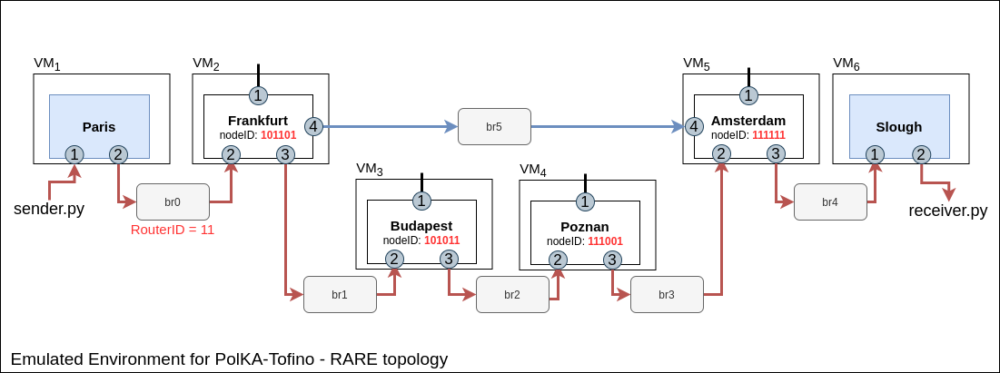

# How to deploy a linear topology PolKA for Tofino using P4 Studio environment

This deployment option is intended mainly for testing and development. To start the environment you have to simply run:

```sh
$ vagrant --number-vms=<number_of_vms> up
```

The reload is issued just to make sure all VMs are correctly setup. This should only be necessary after running `vagrant up` for the first time (VM creation and provisioning).

Download and copy `bf-sde-*.tar` and `bf-tool-*.tar` files to ../build directory (NDA restrictions).

After any PolKA script modification, run the following command:

```sh
$ vagrant provision
```

After provisioning the VMs, the Vagrantfile will create the following architecture:



`Paris` and `Slough` are the VMs used to either generate or receive the traffic based on the PolKA source-routing.
