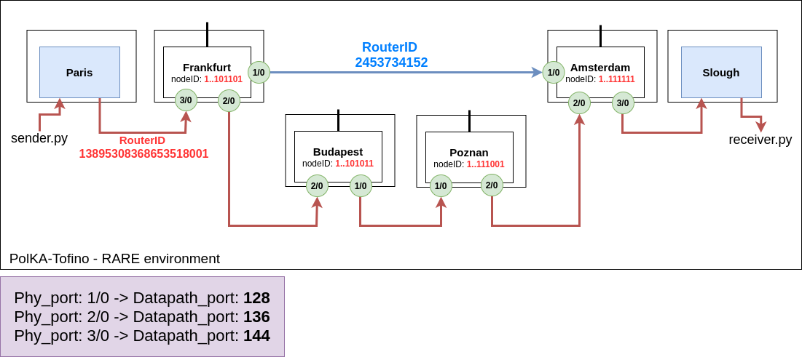

# PolKA-Tofino experiment in the RARE evironment.

The Figure below shows how the ports are mapped regarding the RARE topology and the use-case test. Once that the output port is the result of a polynomial modulo operation, the routeID is composed by the paths between ``Paris`` and ``Slough`` (output port on each hop).

As shown by the Figure, to pass through the longest path crossing ``Frankfurt -> Budapest -> Poznan -> Amsterdam``, the routeID previously calculated equal ``13895308368653518001``. For the shortest path going to ``Frankfurt -> Amsterdam`` only, the routeID previously calculated is ``2453734152``. To calculate the routeID we need a set of nodeID and output port formed by the path.

For more details about how we calculate the routeID based on the set of nodeID and output port, we advise you to read the paper ``PolKA: Polynomial Key-based Architecture for Source Routing in Network Fabrics``(https://ieeexplore.ieee.org/abstract/document/9165501/).